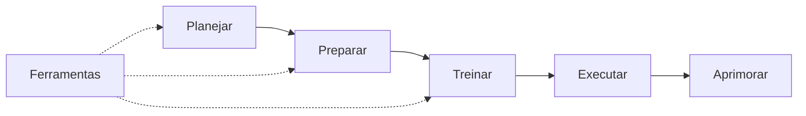

# Palestrante de Sucesso

> **Transforme seu mindset, conquiste sua audiência.**

Aplicativo multiplataforma (**Flutter**) para capacitar oradores no **Método Shinyashiki** (*Os segredos das apresentações poderosas*): planejar, preparar, treinar, executar no palco e aprimorar com métricas reais — com módulos adicionais de ensino, IA e coach vocal (**Ensaio be-T**).

| | |
|---|---|
| **Pacote** | `palestrante_de_sucesso` |
| **Versão** | `1.0.0+1` |
| **SDK Dart** | `^3.11.3` |
| **Plataformas** | Android · iOS · Web · macOS · Windows · Linux |
| **Estado** | Desenvolvimento ativo |

---

## Índice

- [Visão geral](#visão-geral)
- [Funcionalidades](#funcionalidades)
- [Stack tecnológica](#stack-tecnológica)
- [Arquitetura](#arquitetura)
- [Estrutura do projeto](#estrutura-do-projeto)
- [Pré-requisitos](#pré-requisitos)
- [Instalação e execução](#instalação-e-execução)
- [Configuração de ambiente](#configuração-de-ambiente)
- [Testes e qualidade](#testes-e-qualidade)
- [Build e publicação](#build-e-publicação)
- [Documentação complementar](#documentação-complementar)
- [Troubleshooting](#troubleshooting)
- [FAQ](#faq)
- [Roadmap](#roadmap)
- [Contribuição](#contribuição)
- [Licença](#licença)

---

## Visão geral

O **Palestrante de Sucesso** (*Poder de Convencer* no `MaterialApp`) organiza a jornada do palestrante em **cinco passos** do ciclo de performance e um **hub de ferramentas** que estende o app sem quebrar o fluxo principal de discursos.



| Camada | Responsabilidade |
|--------|------------------|
| **Screens / Widgets** | UI, navegação e composição visual |
| **Providers** | Estado reativo (`ChangeNotifier` + Provider) |
| **Services** | HTTP, persistência, áudio, STT, análise vocal, exportação |
| **Models** | Entidades imutáveis, `fromJson` / `toJson` |
| **Core** | Tema, constantes, rotas de API, utilitários |

**Princípios de engenharia:** arquitetura em camadas (*layer-first*), null safety, separação UI/regra de negócio, persistência **offline-first** com sincronização opcional via API REST.

> Screenshots: adicione capturas em `doc/assets/screenshots/` quando disponíveis e referencie aqui.

---

## Funcionalidades

### Ciclo de performance (5 passos)

| Passo | Módulo | Destaques |
|-------|--------|-----------|
| 1 | **Planejar** | Setup wizard, KPI de sucesso, workflows *Objetivo Próprio* / *Objetivo do Cliente*, Quick Pitch (5 min) |
| 2 | **Preparar** | Arquitetura da mensagem, editor de esboço, marco *Pico de Eureca* |
| 3 | **Treinar** | Simulador de plateia, ritual de concentração, checklist de posse de palco |
| 4 | **Executar** | Modo Palco, teleprompter, contador de silêncio, urgência da largada |
| 5 | **Aprimorar** | Métricas de sucesso, feedback loops, biblioteca de características oratórias |

### Hub de ferramentas (Início)

| Ferramenta | Descrição |
|------------|-----------|
| **Central da Reunião** | Comentários (favoritos/notas) e respostas geradas com IA |
| **A Sentinela** | Estudos: CRUD, comentários iniciais/finais, configurações de IA |
| **Discursos** | CRUD, manuscrito, guia, melhorias com IA |
| **Partes 10 min** | CRUD, esboço, apresentação com timer |
| **Timer Pro** | Cronômetro fullscreen com split (1+7+2) e alertas visuais |
| **Meu Estúdio** | Tópicos curtos, flashcards, refinamento com IA |
| **Ensaio be-T** | Coach vocal em tempo real: STT, métricas, histórico, relatório, PDF — *Ensaie. Treine. Evolua.* |
| **Autoavaliação be-T** | Checklist das 53 características com histórico |
| **Masterclass Shinyashiki** | Passos pedagógicos do método |

Detalhamento do **Ensaio be-T**: [doc/mobile/ensaio-be-t-funcionalidades.md](doc/mobile/ensaio-be-t-funcionalidades.md).

---

## Stack tecnológica

| Categoria | Tecnologia |
|-----------|------------|
| Framework | [Flutter](https://flutter.dev) 3.x (stable) |
| Linguagem | [Dart](https://dart.dev) `^3.11.3` |
| Estado | [provider](https://pub.dev/packages/provider) `^6.1.2` |
| Persistência local | [shared_preferences](https://pub.dev/packages/shared_preferences) |
| Rede | [http](https://pub.dev/packages/http) |
| Áudio / voz | [record](https://pub.dev/packages/record), [audioplayers](https://pub.dev/packages/audioplayers), [speech_to_text](https://pub.dev/packages/speech_to_text) |
| Utilitários | [uuid](https://pub.dev/packages/uuid), [intl](https://pub.dev/packages/intl), [path_provider](https://pub.dev/packages/path_provider), [wakelock_plus](https://pub.dev/packages/wakelock_plus) |
| Exportação | [pdf](https://pub.dev/packages/pdf), [share_plus](https://pub.dev/packages/share_plus) |
| Qualidade | [flutter_lints](https://pub.dev/packages/flutter_lints), `flutter test`, `flutter analyze` |
| Backend | API REST Laravel (contrato em `doc/mobile/`) — **opcional** para vários fluxos |

**Banco de dados:** não há SQLite no app; entidades são serializadas em JSON no `SharedPreferences` via `StorageService`.

**Docker / CI:** não configurados neste repositório.

---

## Arquitetura

### Fluxo de dados

```text
┌─────────────┐     listen      ┌──────────────┐     read/write    ┌─────────────────┐
│   Screens   │ ◄────────────── │  Providers   │ ◄───────────────► │ StorageService  │
│  / Widgets  │                 │ (ViewModel)  │                   │ (offline JSON)  │
└─────────────┘                 └──────┬───────┘                   └─────────────────┘
                                       │
                                       ▼
                                ┌──────────────┐
                                │   Services   │──── HTTP ────► API REST (opcional)
                                │ ApiService,  │
                                │ Voice*, etc. │
                                └──────────────┘
```

### Injeção de dependências

Providers são registrados no ponto de entrada (`lib/main.dart`) com `MultiProvider`, expondo estado para toda a árvore de widgets sem acoplamento direto nas telas.

### Padrões adotados

- **Provider + `ChangeNotifier`** para estado reativo
- **Service layer** singleton para I/O e regras transversais
- **Modelos imutáveis** com `copyWith` e serialização JSON
- **Rotas de API centralizadas** em `lib/core/constants/api_routes.dart`
- **Offline-first** no Ensaio be-T; análise online sob opt-in do usuário

---

## Estrutura do projeto

```text
app_apresentacao/
├── lib/
│   ├── core/              # constants, theme, utils
│   ├── models/            # entidades de domínio
│   ├── providers/         # gerenciamento de estado
│   ├── screens/           # telas por fluxo (planning, training, tools/…)
│   ├── services/          # API, storage, voz, exportação, IA heurística
│   ├── utils/             # helpers de navegação e UI
│   ├── widgets/           # componentes reutilizáveis (shell, ensaio, relatório)
│   └── main.dart          # bootstrap + MultiProvider
├── assets/
│   ├── data/              # JSON estático (características, masterclass, …)
│   └── images/
├── test/                  # testes unitários e de widget
├── doc/
│   ├── mobile/            # contratos API, ensaio be-T, integração backend
│   └── ensino/            # material metodológico
├── android/ ios/ web/ macos/ windows/ linux/
├── pubspec.yaml
└── analysis_options.yaml
```

| Pasta `lib/screens/tools/` | Conteúdo |
|----------------------------|----------|
| `meeting/` | Central da Reunião |
| `assentinel/` | A Sentinela |
| `discursos/` | Admin de discursos |
| `partes/` | Partes de 10 minutos |
| `timer/` | Timer Pro |
| `studio/` | Meu Estúdio |
| `bet_guide/` | Ensaio be-T, autoavaliação, gravações, volume |
| `shinyashiki_masterclass/` | Masterclass |

---

## Pré-requisitos

| Requisito | Notas |
|-----------|--------|
| [Flutter SDK](https://docs.flutter.dev/get-started/install) | Canal **stable** (testado com 3.41.x) |
| Xcode | Para build iOS (macOS) |
| Android Studio / SDK | Para build Android |
| Dispositivo ou emulador | Físico recomendado para microfone e STT no Ensaio be-T |
| Backend (opcional) | Laravel com rotas `doc/mobile/` — só necessário para IA/sincronização remota |

Verifique o ambiente:

```bash
flutter doctor -v
```

---

## Instalação e execução

```bash
# Clone o repositório (substitua pela URL do seu remoto)
git clone <URL_DO_REPOSITORIO>
cd app_apresentacao

# Dependências
flutter pub get

# Listar dispositivos disponíveis
flutter devices

# Executar (dispositivo padrão)
flutter run

# Plataformas específicas
flutter run -d chrome      # Web
flutter run -d ios         # Simulador iOS
flutter run -d android     # Emulador Android
```

### Limpar cache de build

```bash
flutter clean
flutter pub get
```

### Modo profile (performance)

Útil para medir jank e comportamento próximo ao release:

```bash
flutter run --profile
```

No **iOS físico**, o build profile costuma ter validade limitada para instalação ad hoc — use o UDID do seu aparelho apenas localmente (`flutter devices`), **sem commitar** identificadores no repositório:

```bash
flutter run --profile -d <DEVICE_ID>
```

### Ícone do app

```bash
dart run flutter_launcher_icons
```

---

## Configuração de ambiente

### URL da API

A base da API é definida em código (não há arquivo `.env` no app):

```dart
// lib/core/constants/app_constants.dart
static const String apiBaseUrl = 'https://codeline43.com.br/api';
```

Para desenvolvimento local, altere temporariamente para o seu backend (exemplo):

```dart
// static const String apiBaseUrl = 'http://localhost:8001/api';
```

| Item | Valor / convenção |
|------|-------------------|
| Prefixo v1 | `{apiBaseUrl}/v1/...` |
| Rotas canônicas | `lib/core/constants/api_routes.dart` |
| Timeout IA (doc) | 60 s |
| Envelope preferido | `{ "data": ... }` (Flutter normaliza legado) |

**Segurança:** não commite tokens, chaves de API, senhas ou UDIDs de dispositivos. Use variáveis locais ou configuração de build não versionada se no futuro migrar para flavors.

### Permissões (Ensaio be-T)

- **Microfone** — gravação e análise de volume
- **Reconhecimento de fala** — transcrição em português (quando disponível no SO)

Confirme `Info.plist` (iOS) e `AndroidManifest.xml` após alterações de plugins de áudio/voz.

### IDE recomendada

O projeto inclui [`.vscode/settings.json`](.vscode/settings.json) com tema alinhado ao design system e atalhos Dart/Flutter (`formatOnSave`, exclusões de `build/`, etc.).

---

## Testes e qualidade

```bash
# Todos os testes
flutter test

# Análise estática
flutter analyze

# Teste de um arquivo
flutter test test/voice_analysis_engine_test.dart
```

Há **20+ arquivos** de teste cobrindo providers, motor de análise vocal, exportação de relatório, teleprompter, calibração de volume e payloads de análise online.

**Boas práticas no código:**

- Null safety estrito
- Lints via `flutter_lints` (`analysis_options.yaml`)
- Lógica de negócio nos providers/services, não nos widgets

---

## Build e publicação

```bash
# Android APK
flutter build apk --release

# Android App Bundle (Play Store)
flutter build appbundle --release

# iOS (requer assinatura Apple)
flutter build ios --release

# Web
flutter build web --release
```

Consulte a [documentação oficial de deploy](https://docs.flutter.dev/deployment) para assinatura, provisioning e lojas.

---

## Documentação complementar

| Documento | Conteúdo |
|-----------|----------|
| [doc/mobile/README.md](doc/mobile/README.md) | Índice mobile + convenções de API |
| [doc/mobile/contrato-json-backend-flutter.md](doc/mobile/contrato-json-backend-flutter.md) | Contrato JSON request/response |
| [doc/mobile/ensaio-be-t-funcionalidades.md](doc/mobile/ensaio-be-t-funcionalidades.md) | Ensaio be-T (completo) |
| [doc/mobile/contrato-ensaio-analise-online.md](doc/mobile/contrato-ensaio-analise-online.md) | Análise online opcional |
| [doc/mobile/ROTAS-PRODUCAO.md](doc/mobile/ROTAS-PRODUCAO.md) | Rotas publicadas em produção |
| [Escopo.md](Escopo.md) | PRD / escopo de produto |

---

## Troubleshooting

| Problema | Possível solução |
|----------|------------------|
| `flutter pub get` falha | `flutter upgrade`; confira versão do Dart `^3.11.3` |
| STT não transcreve | Permissões de microfone; teste em dispositivo físico; idioma `pt_BR` |
| API retorna 404 | Compare com [ROTAS-PRODUCAO.md](doc/mobile/ROTAS-PRODUCAO.md); evite rotas legadas `/api/wol/` |
| iOS: build falha após plugin | `cd ios && pod install && cd ..` |
| Análise online não dispara | Feature opt-in; ver contrato em `contrato-ensaio-analise-online.md` |
| Hot reload estranho em provider | Reinicie com `R` ou `flutter run` limpo após mudança em `main.dart` |

---

## FAQ

**O app funciona sem internet?**  
Sim, para o ciclo local, persistência e a maior parte do **Ensaio be-T**. Recursos de IA e sincronização dependem da API.

**Onde altero a URL do backend?**  
`lib/core/constants/app_constants.dart` → `apiBaseUrl`.

**Qual a diferença entre Ensaio be-T e Autoavaliação be-T?**  
Ensaio: métricas **vocais** ao vivo (WPM, muletas, volume). Autoavaliação: checklist das **53 características** (inclui aspectos não detectáveis só por áudio).

**Há banco SQLite?**  
Não. Dados locais em `SharedPreferences` como JSON.

---

## Roadmap

Itens alinhados ao código e à documentação mobile (não exaustivo):

1. **Sincronização offline-first** — fila/outbox para esboços e notas quando a rede voltar
2. **LEIA via API** — `POST /v1/discursos/sugerir-versiculos` no Estúdio
3. **Chat IA** — tela dedicada no hub de Ferramentas
4. Cobertura de testes e polish do modo visual do Ensaio be-T

---

## Contribuição

1. Crie uma branch a partir da principal: `feat/descricao-curta` ou `fix/descricao-curta`
2. Mantenha escopo focado; siga a estrutura em camadas existente
3. Rode `flutter analyze` e `flutter test` antes do PR
4. Atualize `doc/mobile/` quando alterar contratos de API ou fluxos be-T

### Convenção de commits (sugestão)

```text
feat: nova funcionalidade
fix: correção de bug
docs: documentação
test: testes
refactor: refatoração sem mudança de comportamento
chore: build, deps, tooling
```

---

## Licença

Este repositório **não inclui arquivo LICENSE** na raiz. O uso, distribuição e contribuição externa dependem da política do mantenedor do projeto. Entre em contato com os responsáveis antes de publicar forks ou derivados.

---

<p align="center">
  <strong>Palestrante de Sucesso</strong> — transformando tempo em evolução.
</p>
