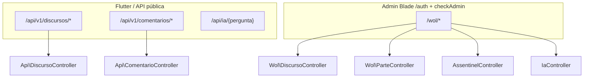

# Módulo de Ensino / Oratória (WOL + API Flutter)

Documentação técnica do backend Laravel voltado a **estudo teocrático**, **partes de reunião**, **discursos** e **geração assistida por IA**.

## Índice

| Documento | Conteúdo |
|-----------|----------|
| [mapeamento-rotas.md](./mapeamento-rotas.md) | URLs, métodos HTTP, autenticação, payloads e o que cada rota gera |
| [relatorio-metodologico.md](./relatorio-metodologico.md) | Shinyashiki (5 passos), be-T, LEIA, 53 características, lacunas e roadmap |
| [roadmap-funcionalidades.md](./roadmap-funcionalidades.md) | Ideias novas (avaliação esboço, S-315, ensaio, 53 características) |
| [brief-backend-novas-rotas.md](./brief-backend-novas-rotas.md) | Resumo técnico backend (espelha mobile) |
| [../mobile/briefing-backend-ensino.md](../mobile/briefing-backend-ensino.md) | **Briefing formal** enviado pelo Flutter |
| [../mobile/plano-api-ensino.md](../mobile/plano-api-ensino.md) | Plano completo para o app mobile |
| [../mobile/contrato-json-backend-flutter.md](../mobile/contrato-json-backend-flutter.md) | Contrato JSON Flutter ↔ API |
| [../api_documentacao_v1.md](../api_documentacao_v1.md) | Contrato JSON da API v1 para o app Flutter |

**Scripts:** `scripts/ensino/brief-backend.sh` (resumo no terminal) · `scripts/ensino/prompt-implementacao.md` (sessão Cursor)

## Visão rápida: dois “mundos” de acesso

- **Flutter** consome principalmente `routes/api.php` (`/api/v1/...`).
- **Painel WOL** usa `routes/web.php` com prefixo `/wol` (sessão Laravel + middleware `checkAdmin`).

## Entidades principais

| Modelo | Uso |
|--------|-----|
| `Discurso` | Discurso público: esboço, manuscrito, guia (`guide`), metadados |
| `Parte` | Parte de reunião (tópicos JSON, esboço manuscrito) |
| `AssentinelStudy` | Estudo Sentinela: comentário inicial/final + resumo |
| `Reuniao` + `Comentario` | Comentários da leitura semanal (Joia Espiritual) |
| `RespostaGerada` | Respostas a perguntas sobre fonte de pesquisa |
| `Setting` | Prompts globais editáveis (`prompt_discurso_geral`, etc.) |

## Serviço de IA

Toda geração passa por `App\Services\AiServiceInterface` (implementação configurável em `/wol/configuracao-ia`). Controllers WOL antigos de discurso ainda usam **Gemini direto** em `improveManuscrito`.
