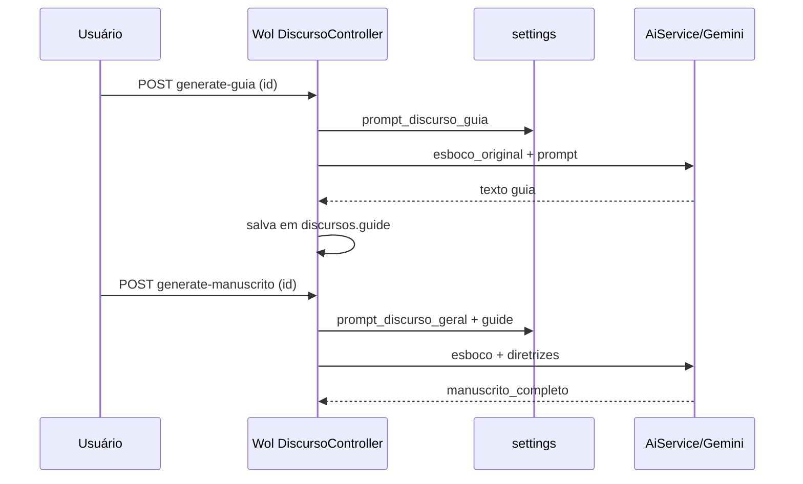

# Mapeamento de rotas — Ensino / Geração de conteúdo

Base URL de desenvolvimento: `http://localhost:8001` (ajuste conforme `.env`).

Legenda:
- **Gera IA** = chama modelo e persiste ou retorna texto gerado
- **CRUD** = apenas dados do usuário
- **UI** = página Blade (não é JSON)

---

## 1. API v1 — Flutter / mobile (`/api/v1`)

Prefixo Laravel: `/api` + grupo `v1` → **`/api/v1`**

| Método | URL | Controller | Tipo | O que faz |
|--------|-----|------------|------|-----------|
| `GET` | `/api/v1/discursos` | `Api\DiscursoController@index` | CRUD | Lista discursos salvos |
| `POST` | `/api/v1/discursos` | `store` | CRUD | Cria discurso (tema, esboco, manuscrito, etc.) |
| `GET` | `/api/v1/discursos/{id}` | `show` | CRUD | Detalhe de um discurso |
| `DELETE` | `/api/v1/discursos/{id}` | `destroy` | CRUD | Exclui discurso |
| `POST` | `/api/v1/discursos/gerar-manuscrito/total` | `gerarManuscritoTotal` | **Gera IA** | Ideias brutas → JSON estruturado (título, objetivo, intro, pontos, conclusão) |
| `POST` | `/api/v1/discursos/sugerir-versiculos` | `sugerirVersiculos` | **Gera IA** | Tema → versículos no formato **LEIA** (ler/explicar/ilustrar/aplicar) |

### Payloads API v1 (geração)

**Gerar manuscrito total**
```http
POST /api/v1/discursos/gerar-manuscrito/total
Content-Type: application/json

{ "conteudo_bruto": "notas ou transcrição" }
```

**Sugerir versículos (LEIA)**
```http
POST /api/v1/discursos/sugerir-versiculos
Content-Type: application/json

{ "tema": "tema do discurso ou parte" }
```

Documentação detalhada: [api_documentacao_v1.md](../api_documentacao_v1.md).

---

## 2. API — Comentários semanais (`/api/v1/comentarios`)

| Método | URL | Controller | Tipo | O que faz |
|--------|-----|------------|------|-----------|
| `GET` | `/api/v1/comentarios/semanal` | `Api\ComentarioController@semanal` | Leitura | Comentários da semana corrente + reunião + tags |
| `GET` | `/api/v1/comentarios/historico` | `historico` | Leitura | Histórico de reuniões com contagem de comentários |

> Não há rota API para **gerar** comentários; a geração é feita no painel WOL ou via rotas legadas abaixo.

---

## 3. API — WOL / IA auxiliar (`/api`)

| Método | URL | Controller | Tipo | O que faz |
|--------|-----|------------|------|-----------|
| `GET` | `/api/ia/{question}` | `IaController@processQuestion` | **Gera IA** | Chat livre (pergunta na URL) |
| `GET` | `/api/wol/reuniao` | `IaController@scrapeWol` | Stub | Retorna “em desenvolvimento” |
| `POST` | `/api/wol/comentarios` | `IaController@gerarComentarios` | **Gera IA** | Gera até 3 comentários por versículo da semana atual |
| `GET` | `/api/wol/doc` | `Api\DocumentationController@show` | Doc | Documentação da API |

---

## 4. Painel WOL — Discursos (`/wol/discursos`)

Middleware: `auth`, `checkAdmin`.

| Método | URL (nome da rota) | Tipo | O que faz |
|--------|-------------------|------|-----------|
| `GET` | `/wol/discursos` (`discursos.index`) | UI | Lista discursos |
| `POST` | `/wol/discursos` (`discursos.store`) | CRUD | Novo discurso |
| `PUT` | `/wol/discursos/{id}` (`discursos.update`) | CRUD | Atualiza metadados + campo `guide` |
| `DELETE` | `/wol/discursos/{id}` (`discursos.destroy`) | CRUD | Exclui |
| `GET` | `/wol/discursos/{id}/edit` | UI | Edição (esboço, guia manual) |
| `POST` | `/wol/discursos/generate-manuscrito` | **Gera IA** | Esboço + prompt global → `manuscrito_completo` |
| `POST` | `/wol/discursos/generate-guia` | **Gera IA** | Esboço + `prompt_discurso_guia` → campo `guide` |
| `GET` | `/wol/discursos/settings` | Config | Lê prompts globais |
| `POST` | `/wol/discursos/settings` | Config | Salva `prompt_discurso_geral` e `prompt_discurso_guia` |
| `GET` | `/wol/discursos/{id}/manuscrito/edit` | UI | Editor de manuscrito + ferramentas (fonte, Pomodoro, melhorar IA) |
| `PUT` | `/wol/discursos/{id}/manuscrito` | CRUD | Salva manuscrito |
| `POST` | `/wol/discursos/{id}/manuscrito/improve` | **Gera IA** | Melhora trecho do manuscrito (instruções do usuário) |
| `GET` | `/wol/discursos/{id}/apresentacao` | UI | Modo apresentação (leitura do manuscrito) |

### Fluxo típico (discurso)



**Observação de schema:** existe coluna legada `guia_estudo` (migration antiga) e coluna ativa `guide`. O código usa apenas **`guide`**.

---

## 5. Painel WOL — Partes de reunião (`/wol/partes`)

| Método | URL (rota) | Tipo | O que faz |
|--------|------------|------|-----------|
| `GET` | `/wol/partes` | UI | Lista partes |
| `POST` | `/wol/partes` | CRUD | Cria parte (tema, tópicos[], conteudo_original) |
| `PUT` | `/wol/partes/{id}` | CRUD | Atualiza |
| `DELETE` | `/wol/partes/{id}` | CRUD | Exclui |
| `GET` | `/wol/partes/{id}/edit` | UI | Edição de metadados/tópicos |
| `POST` | `/wol/partes/generate-esboco` | **Gera IA** | Manuscrito palavra-a-palavra → `esboco_manuscrito` (busca textos em bible-api.com) |
| `GET` | `/wol/partes/{id}/esboco/edit` | UI | Editor do esboço manuscrito |
| `PUT` | `/wol/partes/{id}/esboco` | CRUD | Salva esboço |
| `POST` | `/wol/partes/{id}/esboco/improve` | **Gera IA** | Melhora seção do esboço |
| `GET` | `/wol/partes/{id}/apresentacao` | UI | Apresentação + **timer 10 minutos** |
| `GET/POST` | `/wol/partes/settings` | Config | `prompt_parte_geral` |

Estrutura fixa no prompt de geração: **Introdução → desenvolvimento por tópico (ler/explicar/fonte) → Conclusão**.

---

## 6. Painel WOL — Comentários da reunião (`/wol/comentarios`)

| Método | URL | Tipo | O que faz |
|--------|-----|------|-----------|
| `GET` | `/wol/comentarios` | UI | Página semanal: texto bíblico, comentários, aba respostas |
| `POST` | `/wol/comentarios/texto` | CRUD | Salva livro/capítulo/texto da semana |
| `POST` | `/wol/comentarios/{id}/improve` | **Gera IA** | Refina um comentário existente |
| `GET` | `/wol/gerar-comentarios/{livro}/{capitulo}` | **Gera IA** | Gera comentários para capítulo (admin) |

Equivalente API: `POST /api/wol/comentarios` (sem auth explícita no grupo — ver segurança em produção).

---

## 7. Painel WOL — Assentinel (estudo Sentinela)

| Método | URL | Tipo | O que faz |
|--------|-----|------|-----------|
| `GET` | `/wol/assentinela` | UI | Lista estudos |
| `POST` | `/wol/assentinela` | CRUD | Salva `conteudo_estudo` |
| `DELETE` | `/wol/assentinela/{id}` | CRUD | Exclui |
| `POST` | `/wol/assentinela/generate-initial` | **Gera IA** | `comentario_inicial` (prompt `prompt_inicial`) |
| `POST` | `/wol/assentinela/generate-final` | **Gera IA** | `comentario_final` (prompt `prompt_final`) |
| `POST` | `/wol/assentinela/generate-summary` | **Gera IA** | `resumo_comentarios` (ponte entre inicial e final) |
| `GET/POST` | `/wol/assentinela/settings` | Config | Três prompts configuráveis |

---

## 8. Outras rotas WOL relacionadas

| Método | URL | Tipo | O que faz |
|--------|-----|------|-----------|
| `POST` | `/wol/respostas-geradas` | **Gera IA** | Comentário/resposta a partir de fonte + texto base |
| `POST` | `/wol/respostas-geradas/{id}/improve` | **Gera IA** | Melhora resposta salva |
| `GET` | `/wol/gvp` | UI | Cartão GVP (não é oratória) |
| `GET/POST` | `/wol/configuracao-ia` | Config | Provedor/chave do serviço de IA |
| `GET/POST` | `/wol/agentes-ia` | Ferramenta | Agentes Cursor (dev) |

---

## 9. Tabela resumo — “O que gera conteúdo?”

| Produto gerado | Rota principal (admin) | Rota API (Flutter) |
|----------------|------------------------|-------------------|
| Manuscrito de discurso (longo) | `POST /wol/discursos/generate-manuscrito` | `POST /api/v1/discursos/gerar-manuscrito/total` (formato JSON estruturado, não salva automaticamente) |
| Guia prático de estudo | `POST /wol/discursos/generate-guia` | — (não exposto na v1) |
| Esboço/manuscrito de parte | `POST /wol/partes/generate-esboco` | — |
| Versículos LEIA | — | `POST /api/v1/discursos/sugerir-versiculos` |
| Comentários ~30s (reunião) | `POST /api/wol/comentarios` ou `GET /wol/gerar-comentarios/...` | Leitura: `GET /api/v1/comentarios/semanal` |
| Comentários Sentinela | `POST /wol/assentinela/generate-*` | — |
| Melhoria pontual de texto | `*/improve` em discurso, parte, comentário, resposta | — |
| Chat livre | — | `GET /api/ia/{pergunta}` |

---

## 10. Prompts globais (`settings` table)

| Chave | Usado em |
|-------|----------|
| `prompt_discurso_geral` | Manuscrito de discurso |
| `prompt_discurso_guia` | Guia prático (`guide`) |
| `prompt_parte_geral` | Esboço manuscrito de parte |
| `prompt_inicial` | Assentinel comentário inicial |
| `prompt_final` | Assentinel comentário final |
| `prompt_resumo` | Assentinel resumo |

Seed padrão do manuscrito (`GeneralDiscoursePromptSeeder`): pede introdução, pontos e conclusão — **sem** nomenclatura be-T explícita.

---

## 11. Lacunas de API para o Flutter (referência rápida)

Rotas **existentes no admin** mas **ausentes em `/api/v1`**:

- Gerar guia prático
- Gerar esboço de parte
- CRUD de partes
- Assentinel (estudo + comentários)
- Melhorar trecho (`improve`)
- Apresentação / timer 10 min (hoje só Blade)

Ver [relatorio-metodologico.md](./relatorio-metodologico.md) para priorização funcional.
