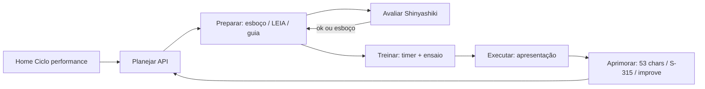

# Roadmap de funcionalidades — Ensino / Oratória (app + API)

> **Atualizado:** alinhado ao briefing Flutter (21/05/2026).  
> **Canônico para rotas e JSON:** [../mobile/briefing-backend-ensino.md](../mobile/briefing-backend-ensino.md) · [../mobile/plano-api-ensino.md](../mobile/plano-api-ensino.md) · [../mobile/contrato-json-backend-flutter.md](../mobile/contrato-json-backend-flutter.md)

Documento de **ideação** alinhado a [relatorio-metodologico.md](./relatorio-metodologico.md), [mapeamento-rotas.md](./mapeamento-rotas.md) e ao formulário **S-315** (Avaliação de Oradores e Intérpretes).

**Problema central (dor do produto):** o backend hoje é um **gerador de texto pronto**. O app na home mostra o **Ciclo de performance** (5 passos Shinyashiki), mas a API não sustenta cada etapa com rotas dedicadas — só “Preparar” parcialmente (manuscrito, LEIA, comentários).

**Objetivo:** rotas que **guiem estudo**, **avaliam** sem substituir o manual, e **registram progresso** — especialmente para **partes (10 min)**, **discursos** e **palestras/congresso** (avaliação de oradores).

---

## 1. Mapa mental: Ciclo de performance × módulos

| Passo (home) | Partes | Discursos | Palestras / S-315 | Central reunião | Assentinel |
|--------------|--------|-----------|-------------------|-----------------|------------|
| **Planejar** | Tema, tempo, público, objetivo | Tema, objetivo, cântico, data | Idioma, tipo (DIS/ENT/INT) | Texto da semana | Matéria do estudo |
| **Preparar** | Esboço tópicos + LEIA | Esboço → guia → manuscrito | Ficha observações (não gerar discurso) | Respostas + comentários | Comentários inicial/final |
| **Treinar** | Timer 10 min, ensaio, WPM | Ensaio longo, divisão tempo | — (avaliação é de terceiros) | Cronômetro ~30s | — |
| **Executar** | Modo apresentação | Modo apresentação | — | Ler comentário na reunião | Ler comentário |
| **Aprimorar** | Autoavaliação 53 / feedback | Revisão manuscrito + IA | Avaliação A/B/C/NR | Melhorar comentário | Resumo-ponte |

---

## 2. Funcionalidades novas (priorizadas)

### P0 — Fechar lacunas já documentadas

Espelhar `/wol` em `/api/v1` (ver [backend-requisitos-api.md](../mobile/backend-requisitos-api.md)):

- Partes CRUD + `gerar-esboco` + `improve`
- Discursos: PUT, `gerar-guia`, `gerar-manuscrito` por id, `improve`
- Respostas geradas (Central)
- Comentários: gerar + melhorar

### P1 — **Avaliar esboço/manuscrito (método Shinyashiki + be-T)** ⭐ pedido

**Rota canônica (Flutter):** `POST /api/v1/avaliar/esboco` — ver [contrato-json-backend-flutter.md](../mobile/contrato-json-backend-flutter.md)

**Entrada:**

```json
{
  "tipo": "parte|discurso|palestra",
  "formato": "esboco_topicos|manuscrito|guia",
  "texto": "...",
  "tempo_alvo_minutos": 10,
  "objetivo_declarado": "opcional",
  "metodologia": ["shinyashiki", "be-t", "leia"]
}
```

**Saída (não reescreve o texto):**

```json
{
  "success": true,
  "ciclo_shinyashiki": {
    "planejar": { "nota": 1, "max": 5, "itens": [{ "id": "objetivo_claro", "ok": true, "observacao": "..." }] },
    "preparar": { "nota": 3, "max": 5, "itens": [] },
    "treinar": { "nota": 2, "max": 5, "itens": [] },
    "executar": { "nota": null, "observacao": "Avaliar após ensaio" },
    "aprimorar": { "nota": null, "observacao": "Use autoavaliação pós-ensaio" }
  },
  "estrutura_be_t": {
    "introducao": { "presente": true, "proporcao_tempo_sugerida": "10%", "feedback": "..." },
    "corpo": { "blocos": 3, "transicoes": "fracas entre ponto 2 e 3" },
    "conclusao": { "presente": true, "alinha_objetivo": true }
  },
  "leia_por_secao": [
    { "referencia": "Jo 3:16", "ler": true, "explicar": true, "ilustrar": false, "aplicar": true }
  ],
  "metricas": {
    "palavras": 1240,
    "minutos_estimados_fala": 9.2,
    "wpm_assumido": 135
  },
  "prioridades_melhoria": [
    "Reduzir manuscrito; criar esboço em tópicos antes de expandir",
    "Adicionar ilustração no ponto 2 (LEIA)"
  ]
}
```

**Regras de produto:**

- IA atua como **coach**, citando critérios be-T/Shinyashiki, **sem** substituir anciãos na avaliação de qualificações espirituais.
- Para `formato=manuscrito` em parte de 10 min: alertar se palavras > ~1350 (≈10 min a 135 wpm).

### P1 — **Avaliação de oradores e intérpretes (inspirado S-315)** ⭐ pedido

Uso: **congregação / circuito** — registro local ou exportação PDF; **não** envio automático a Betel.

**Rotas:**

| Método | URL | Descrição |
|--------|-----|-----------|
| `GET` | `/api/v1/avaliacoes-oradores` | Lista avaliações salvas |
| `POST` | `/api/v1/avaliacoes-oradores` | Nova ficha |
| `GET` | `/api/v1/avaliacoes-oradores/{id}` | Detalhe |
| `PUT` | `/api/v1/avaliacoes-oradores/{id}` | Atualizar |
| `DELETE` | `/api/v1/avaliacoes-oradores/{id}` | Excluir |
| `POST` | `/api/v1/avaliacoes-oradores/{id}/analisar-pre-requisitos` | IA auxilia itens 1–6 (sim/não + orientação) |
| `POST` | `/api/v1/avaliacoes-oradores/{id}/sugerir-observacoes` | IA rascunha itens 9–11 a partir de notas do avaliador |
| `GET` | `/api/v1/avaliacoes-oradores/catalogo` | Perguntas fixas + categorias DIS/ENT/INT |

**Modelo `avaliacao_orador` (campos principais):**

- `nome`, `idioma`, `etnia` (enum: asiatica|negra|hispanica|branca|nao_informar)
- `contato` (se sem JW Hub)
- `ano_anterior_listado` (bool)
- `pre_requisitos` — array das 6 perguntas (2): resposta bool + nota
- `categorias`: `{ "DIS": "A+", "ENT": "B", "INT": "NR" }` — regex `^(A|B|C)(\+|-)?$|^NR$`
- `observacoes_orador`, `observacoes_personalidade`, `observacoes_familia`
- `recomenda_parte_familia` (bool)
- `status`: rascunho | concluida
- `avaliadores_count` (2 ou 3 anciãos — metadado)

**Rota `analisar-pre-requisitos`:** body `{ "notas_livres": "..." }` → IA devolve só **perguntas orientadoras** e lembretes (“se sim em qualquer uma e não estava na lista do ano passado, não incluir”), **sem** decidir por anciãos.

### P2 — Estudo real (antes do manuscrito)

| Rota | Função |
|------|--------|
| `POST /api/v1/estudo/pesquisa` | Perguntas + citações a partir de `fonte` + trecho |
| `POST /api/v1/estudo/meditacao` | 3–5 perguntas por tópico do esboço |
| `POST /api/v1/estudo/memorizar` | Cartões frente/verso |
| `GET /api/v1/estudo/progresso/{tipo}/{id}` | Checklist Shinyashiki persistido |

### P2 — Treinar (10 min e palestras)

| Rota | Função |
|------|--------|
| `POST /api/v1/ensaio/registrar` | `parte_id` ou `discurso_id`, duração_seg, notas |
| `GET /api/v1/ensaio/metas-tempo?tipo=parte` | Split 1+8+1 ou 2+7+1 min |
| `POST /api/v1/oratoria/contar-palavras` | Sem IA — WPM e alertas |

### P3 — 53 características (be-T)

| Rota | Função |
|------|--------|
| `GET /api/v1/oratoria/caracteristicas?tipo=parte_10min` | Subset (~15–20 itens relevantes) |
| `POST /api/v1/oratoria/autoavaliacao` | Scores 1–5 + comentário por item |
| `GET /api/v1/oratoria/autoavaliacao/historico/{recurso_id}` | Evolução no tempo |

### P3 — Palestras (discurso longo)

| Rota | Função |
|------|--------|
| `POST /api/v1/palestras/planejar` | Blocos por tempo total (30/45/60 min) |
| `POST /api/v1/oratoria/avaliar-conteudo` com `tipo=palestra` | Rubrica intro/corpo/conclusão + principais argumentos |

---

## 3. Fluxo sugerido no app (home → Ciclo)



---

## 4. O que **não** colocar na API (limites éticos/jurídicos)

- Decisão automática “recomendado / não recomendado” para congresso (sempre decisão humana dos anciãos).
- Preenchimento obrigatório de etnia sem contexto congregacional.
- Geração de discurso completo como **primeiro** passo sem esboço validado (flag opcional `exigir_esboco_antes_manuscrito`).

---

## 5. Ordem de implementação recomendada

1. P0 backlog ([backend-requisitos-api.md](../mobile/backend-requisitos-api.md))
2. `POST /oratoria/avaliar-conteudo` (Shinyashiki + be-T + LEIA)
3. CRUD `avaliacoes-oradores` + catálogo S-315
4. Ensaio + metas tempo + contar palavras
5. 53 características + autoavaliação

| Documento | Público |
|-----------|---------|
| [../mobile/briefing-backend-ensino.md](../mobile/briefing-backend-ensino.md) | Backend (pedido formal mobile) |
| [../mobile/plano-api-ensino.md](../mobile/plano-api-ensino.md) | Flutter (telas + sprints) |
| [../mobile/contrato-json-backend-flutter.md](../mobile/contrato-json-backend-flutter.md) | Ambos (JSON) |
| [brief-backend-novas-rotas.md](./brief-backend-novas-rotas.md) | Backend (resumo técnico) |
| [../../scripts/ensino/brief-backend.sh](../../scripts/ensino/brief-backend.sh) | Terminal |
| [../../scripts/ensino/prompt-implementacao.md](../../scripts/ensino/prompt-implementacao.md) | Agente Cursor |
