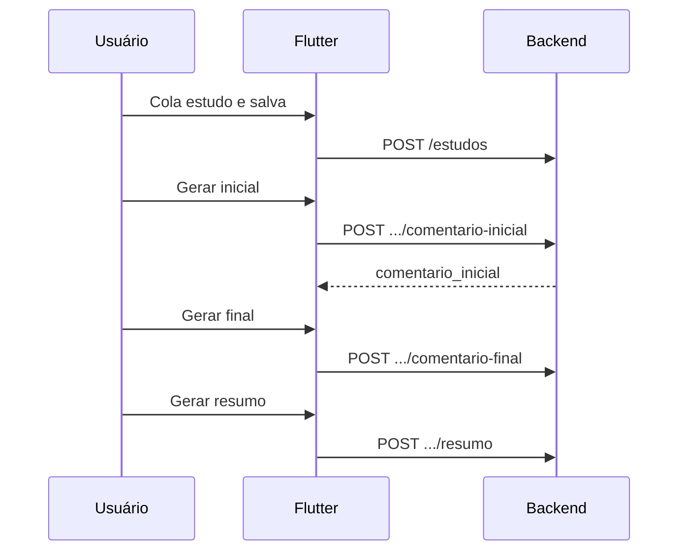

# A Sentinela (app)

Espelha `resources/views/wol/assentinela.blade.php` — **Estudo de A Sentinela**.

---

## Tela principal — estrutura

```
┌─────────────────────────────────────────┐
│  Estudo de A Sentinela          [ tema ]│
├─────────────────────────────────────────┤
│ [+ Adicionar Novo Estudo]               │
│ [⚙ Editar Instruções]                   │
├─────────────────────────────────────────┤
│  Estudos Salvos                         │
│  ┌─ Estudo #12 ───────────────── [X] ─┐ │
│  │ Comentário Inicial    │ Final      │ │
│  │ [Gerar/Ver/Melhorar]  │ [idem]     │ │
│  │ Resumo-Ponte (rodapé)               │ │
│  └────────────────────────────────────┘ │
└─────────────────────────────────────────┘
```

---

## Botões de ação (header)

| Botão web | Ação no app | Rota |
|-----------|-------------|------|
| **Adicionar Novo Estudo** | Navegar para formulário ou bottom sheet | `POST` criar estudo |
| **Editar Instruções** | Tela/modal 3 textareas | `GET/PUT settings` |

---

## Adicionar estudo

| Campo | Obrigatório | UI |
|-------|-------------|-----|
| `conteudo_estudo` | Sim | Textarea grande — “Cole aqui o conteúdo do estudo” |

**Botão:** Salvar Estudo

| Plataforma | Hoje |
|------------|------|
| Web | `POST /wol/assentinela` (form, redirect) |
| App | `POST /api/v1/assentinel/estudos` (proposto) |

---

## Editar instruções globais

Três prompts salvos em `settings`:

| Campo UI | Chave `settings` | Uso |
|----------|------------------|-----|
| Prompt Comentário Inicial | `prompt_inicial` | Gera `comentario_inicial` |
| Prompt Comentário Final | `prompt_final` | Gera `comentario_final` |
| Prompt Resumo-Ponte | `prompt_resumo` | Gera `resumo_comentarios` |

| Ação | Web | App (proposto) |
|------|-----|----------------|
| Carregar | `GET /wol/assentinela/settings` | `GET /api/v1/assentinel/settings` |
| Salvar | `POST /wol/assentinela/settings` JSON | `PUT /api/v1/assentinel/settings` |

Body salvar:

```json
{
  "prompt_inicial": "...",
  "prompt_final": "...",
  "prompt_resumo": "..."
}
```

---

## Card de estudo — listagem

Cada estudo exibe **três blocos**:

### 1. Comentário inicial

| Estado | Botões |
|--------|--------|
| Vazio | **Gerar** (azul/info) |
| Preenchido | **Visualizar**, **Copiar**, **Melhorar** |

### 2. Comentário final

| Estado | Botões |
|--------|--------|
| Vazio | **Gerar** (amarelo/warning no web) |
| Preenchido | **Visualizar**, **Copiar**, **Melhorar** |

### 3. Resumo-ponte (rodapé do card)

| Estado | Botões |
|--------|--------|
| Vazio | **Gerar Resumo** — só se inicial **e** final existirem |
| Preenchido | **Visualizar**, **Copiar**, **Melhorar** |

**Regra de negócio (resumo):** se faltar inicial ou final → API `422`:

> É necessário gerar os comentários inicial e final antes de criar o resumo.

### Excluir estudo

Web: `DELETE /wol/assentinela/{id}` com confirmação.

App: `DELETE /api/v1/assentinel/estudos/{id}`

---

## Gerar / Melhorar comentários

No web, **Gerar** e **Melhorar** usam a **mesma rota** (regenera o bloco inteiro).

| Bloco | Web POST | Body |
|-------|----------|------|
| Inicial | `/wol/assentinela/generate-initial` | `{ "id": 12 }` |
| Final | `/wol/assentinela/generate-final` | `{ "id": 12 }` |
| Resumo | `/wol/assentinela/generate-summary` | `{ "id": 12 }` |

**Resposta web:**

```json
{
  "success": true,
  "comment": "texto gerado..."
}
```

**App:** padronizar campo para `content` na API nova.

**Timeout:** 60s; mostrar spinner no botão.

---

## Visualizar

Modal web `viewStudyModal` — corpo com `white-space: pre-wrap`.

No app:

- Tela ou bottom sheet com texto integral
- Ações: Copiar, Melhorar (fecha modal e dispara generate), Fechar

Conteúdo vem do objeto estudo após listagem/detalhe:

- `comentario_inicial`
- `comentario_final`
- `resumo_comentarios`
- `conteudo_estudo` (visualização opcional do estudo bruto — web guarda em span oculto)

---

## Modelo — `AssentinelStudy`

```json
{
  "id": 1,
  "conteudo_estudo": "texto colado",
  "comentario_inicial": null,
  "comentario_final": null,
  "resumo_comentarios": null,
  "created_at": "...",
  "updated_at": "..."
}
```

---

## Rotas resumo (propostas para backend)

| Ação | Método | URL |
|------|--------|-----|
| Listar | `GET` | `/api/v1/assentinel/estudos` |
| Adicionar | `POST` | `/api/v1/assentinel/estudos` |
| Detalhe | `GET` | `/api/v1/assentinel/estudos/{id}` |
| Excluir | `DELETE` | `/api/v1/assentinel/estudos/{id}` |
| Gerar inicial | `POST` | `/api/v1/assentinel/estudos/{id}/comentario-inicial` |
| Gerar final | `POST` | `/api/v1/assentinel/estudos/{id}/comentario-final` |
| Gerar resumo | `POST` | `/api/v1/assentinel/estudos/{id}/resumo` |
| Settings GET/PUT | | `/api/v1/assentinel/settings` |

Detalhes: [backend-requisitos-api.md](./backend-requisitos-api.md) §2.

---

## Fluxo recomendado no app



Não há tela “Editar estudo” no web após criar — apenas excluir e criar outro. Opcional no app: `PUT` para atualizar `conteudo_estudo`.
