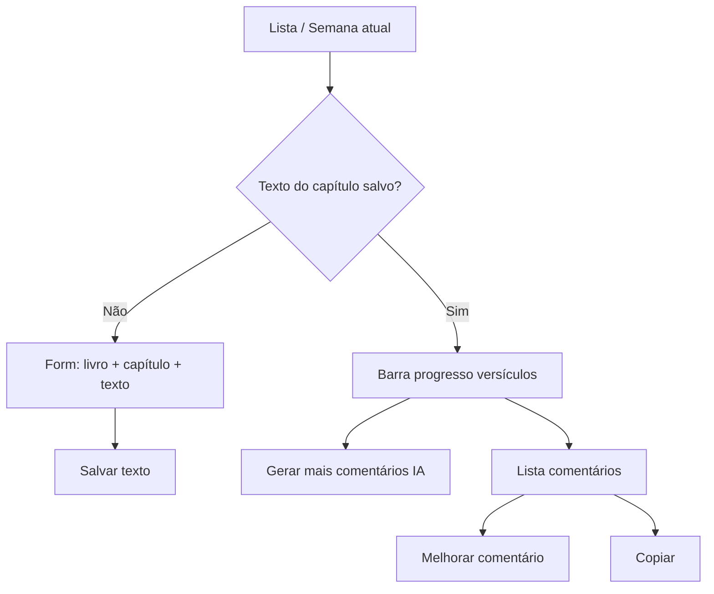

# Central da Reunião (app)

Espelha `resources/views/wol/comentarios.blade.php`.

No app, esta seção pode ter **duas abas** (como no web) ou apenas a aba **Gerador de Respostas** na v1 — abaixo estão as duas.

---

## Aba 1 — Comentários da Reunião (opcional na v1)

### Objetivo

Comentários curtos (~30s) por versículo da leitura da semana (Joia Espiritual), com tags.

### Fluxo de telas



### Ações

| Ação | UI | Backend hoje | API mobile |
|------|-----|--------------|------------|
| Listar semana | Título: livro/capítulo + lista | `GET /api/v1/comentarios/semanal` | ✅ Pronta |
| Salvar texto bíblico | Form 3 campos | `POST /wol/comentarios/texto` (form) | ❌ Criar `POST /api/v1/reuniao/texto` |
| Gerar comentários | Botão verde | `POST /api/wol/comentarios` | ❌ Expor em v1 autenticada |
| Melhorar | Modal + instrução | `POST /wol/comentarios/{id}/improve` (redirect) | ❌ JSON `instrucao_melhoria` |
| Copiar | Cliente | — | — |
| Visualizar | Texto completo na lista | — | — |

### GET semanal — resposta (já documentada)

Ver [api_documentacao_v1.md](../api_documentacao_v1.md) §2.1.

Campos úteis na UI:

- `reuniao.texto_joia_espiritual` — ex.: `"Provérbios 21"`
- `reuniao.capitulo_texto` — texto completo
- `comentarios[].comentario`, `comentarios[].tags[].name`
- Calcular progresso: `criadosCount / totalVersiculos` (web calcula no server; app pode contar versículos únicos nos comentários)

### Tags permitidas (fixas no prompt IA)

`Conselho`, `Ministério de Campo`, `Humildade`, `Qualidades`, `Oração`, `Jeová`, `Jesus`, `Organização`, `Família`, `Perdão`, `Amor`, `Fé`, `Esperança`, `Estudo Pessoal`

---

## Aba 2 — Gerador de Respostas (prioridade do app)

### Objetivo

Gerar resposta a partir de **texto base** + **fonte de pesquisa** (publicação), com pergunta e instrução opcionais. Listar histórico e melhorar respostas salvas.

Equivalente web: linhas 112–181 de `comentarios.blade.php`.

### Layout sugerido no Flutter

1. **FAB ou botão** “Nova resposta” → formulário
2. **Lista** “Respostas geradas” (cards)
3. Por card: pergunta (se houver), fonte, preview do texto, ações

### Formulário — Adicionar / Gerar

| Campo | Obrigatório | Placeholder web |
|-------|-------------|-----------------|
| `pergunta` | Não | “Se houver uma pergunta específica…” |
| `texto_base` | Sim | “Cole o texto que servirá de base…” |
| `fonte_pesquisa` | Sim | “Ex: w23.01 pág. 5 par. 3” |
| `prompt_especifico` | Não | Default sugerido: `Resposta simples e objetiva` |

**Botão:** “Gerar Resposta” → loading 15–60s → adicionar item no topo da lista.

### Listagem — campos por item

| Campo | Exibir |
|-------|--------|
| `id` | interno |
| `pergunta` | título opcional “Pergunta: …” |
| `fonte_pesquisa` | subtítulo “Fonte: …” |
| `resposta_gerada` | corpo (markdown opcional) |
| `created_at` | data relativa |

### Ações por item

| Botão | Tipo | Comportamento |
|-------|------|---------------|
| **Melhorar** | Melhorar (editor) | Abre modal: mostra resposta atual + campo `instrucao_melhoria` → POST improve → atualiza card |
| **Copiar** | Cliente | `Clipboard.setData(resposta_gerada)` |
| **Visualizar** | Visualizar | Tela cheia com `resposta_gerada` (opcional) |
| **Excluir** | — | Não existe no web; opcional no app se API criar DELETE |

### Melhorar resposta — modal

| Campo | Obrigatório |
|-------|-------------|
| Resposta atual | somente leitura |
| `instrucao_melhoria` | Sim — ex.: “Torne mais curto” |

Web: `POST /wol/respostas-geradas/{id}/improve` com form field `instrucao_melhoria`.

**Mobile (proposto):** `POST /api/v1/respostas-geradas/{id}/improve`

```json
{ "instrucao_melhoria": "Torne o comentário mais curto e direto." }
```

### Rotas para o backend implementar

Ver [backend-requisitos-api.md](./backend-requisitos-api.md) §1.

| Ação | Método | URL proposta |
|------|--------|--------------|
| Listar | `GET` | `/api/v1/respostas-geradas` |
| Gerar | `POST` | `/api/v1/respostas-geradas` |
| Melhorar | `POST` | `/api/v1/respostas-geradas/{id}/improve` |

### Web (referência — não usar no Flutter)

| Ação | Método | URL web |
|------|--------|---------|
| Gerar | `POST` | `/wol/respostas-geradas` → redirect com flash |
| Melhorar | `POST` | `/wol/respostas-geradas/{id}/improve` → redirect |

### Estados de UI

| Estado | UX |
|--------|-----|
| Carregando geração | Desabilitar botão + spinner |
| Erro IA sobrecarga | Mensagem: serviço sobrecarregado, tentar de novo |
| Lista vazia | “Nenhuma resposta gerada ainda.” |
| Validação 422 | Destacar campos `texto_base`, `fonte_pesquisa` |

### Modelo de dados

Tabela `respostas_geradas`:

```
id, pergunta, texto_base, fonte_pesquisa, prompt_especifico, resposta_gerada, created_at, updated_at
```
