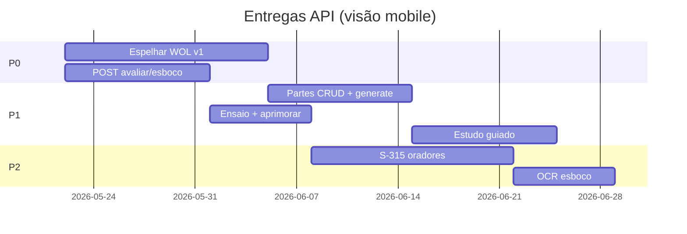
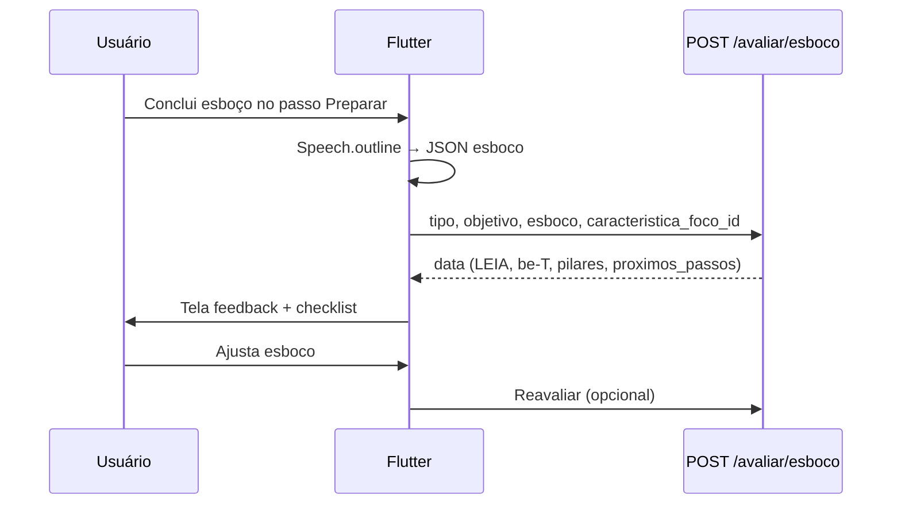

# Plano de API Ensino — Flutter *Poder de Convencer*

**Público:** time mobile (Flutter)  
**Atualizado:** 21/05/2026  
**Origem:** briefing produto mobile + alinhamento backend Code Line 43

Este documento descreve **tudo o que será feito** na API para suportar o app: por fase, por tela do app, status atual e como integrar.

---

## Índice rápido

| Doc | Conteúdo |
|-----|----------|
| [briefing-backend-ensino.md](./briefing-backend-ensino.md) | Pedido formal ao backend (copiar para Laravel) |
| [contrato-json-backend-flutter.md](./contrato-json-backend-flutter.md) | JSON request/response + mapeamento `Speech.outline` |
| [ROTAS-PRODUCAO.md](./ROTAS-PRODUCAO.md) | O que já responde em `codeline43.com.br` |
| [backend-requisitos-api.md](./backend-requisitos-api.md) | Backlog técnico legado (espelho WOL) |

---

## 1. Contexto do app (o que vocês já têm)

| Recurso no Flutter | Onde vive | Sync com backend |
|--------------------|-----------|------------------|
| **Ciclo de Performance** (5 passos) | Home + fluxo discurso/parte | Parcial — passo hoje é **local**; backend passará a persistir em `metadados` + `estudo/progresso` |
| **53 características be-T** | `caracteristicas_oratoria.json` + telas de foco | Local; avaliação cruzada em `avaliar/esboco` e `aprimorar/feedback` |
| **Speech / Speech.outline** | Modelo de esboço | Enviado em `POST /avaliar/esboco` |
| **Autoavaliação be-T** | Ferramenta pós-parte | `POST /aprimorar/feedback` |
| **Timer 10 min** | UI Treinar/Executar | Local hoje; metas do servidor em `GET /ensaio/metas-tempo` |

**Dor que a API resolve:** deixar de depender só de geração de manuscrito e passar a ter **avaliação metodológica**, **partes**, **ensaio** e **feedback** no servidor.

---

## 2. Roadmap por fase (visão produto)



| Fase | Nome | Entregas API | Impacto no app |
|------|------|--------------|----------------|
| **A** | Espelhar WOL | Partes, discursos completo, respostas, comentários/gerar | Telas Discursos, Partes, Central, Assentinel deixam de usar workarounds |
| **B** | Avaliar esboço | `POST /avaliar/esboco` | Botão “Avaliar esboço” no Ciclo (Preparar) |
| **C** | Estudo guiado | pesquisa, meditação, memorizar, progresso | Abas estudo antes do manuscrito |
| **D** | Treinar / Aprimorar | ensaio, metas-tempo, feedback | Fecha Ciclo no servidor |
| **E** | S-315 | avaliacoes-orador (🔒) | Módulo ancianos (feature flag) |
| **—** | Backlog | manuscrito, áudio, OCR, designações | Versões futuras |

---

## 3. Integração por tela do app

### 3.1 Home — Ciclo de Performance

| Passo UI | Ação do usuário | API (quando pronta) | Status |
|----------|-----------------|---------------------|--------|
| Planejar | Define tema, objetivo, tempo | `PUT /discursos/{id}` + `metadados.passo_atual=planejar` | ❌ metadados |
| Preparar | Edita esboço, pede avaliação | `POST /avaliar/esboco` | ❌ P0 |
| Preparar | Gera guia / manuscrito | `generate-guia`, `gerar-manuscrito` | ❌ |
| Preparar | LEIA versículos | `sugerir-versiculos` | ✅ |
| Treinar | Ensaio com timer | `POST /ensaio/registrar`, `GET /ensaio/metas-tempo` | ❌ P1 |
| Executar | Modo palco | Dados locais + `GET /discursos/{id}` | 🟡 |
| Aprimorar | Autoavaliação | `POST /aprimorar/feedback` | ❌ P1 |

**Flutter:** ao concluir avaliação, atualizar passo local e opcionalmente `PUT` metadados quando backend suportar.

### 3.2 Discursos

| Feature | Rota | Status |
|---------|------|--------|
| Lista / CRUD | `GET/POST/DELETE /discursos` | ✅ |
| Editar campos | `PUT /discursos/{id}` | ❌ |
| Gerar manuscrito (notas soltas) | `POST /discursos/gerar-manuscrito/total` | ✅ |
| Gerar manuscrito (por id) | `POST /discursos/{id}/gerar-manuscrito` | ❌ |
| Guia prático | `POST /discursos/{id}/generate-guia` | ❌ |
| Melhorar trecho | `POST /discursos/{id}/manuscrito/improve` | ❌ |
| Avaliar esboço | `POST /avaliar/esboco` | ❌ |
| Settings prompts | `GET/PUT /discursos/settings` | ❌ |

Doc tela: [discursos.md](./discursos.md)

### 3.3 Partes (10 min)

| Feature | Rota | Status |
|---------|------|--------|
| CRUD | `/partes` | ❌ |
| Gerar esboço (`modo`) | `POST /partes/{id}/generate-esboco` | ❌ |
| Melhorar | `POST /partes/{id}/esboco/improve` | ❌ |
| Avaliar esboço | `POST /avaliar/esboco` com `tipo: parte_10min` | ❌ |
| Timer metas | `GET /ensaio/metas-tempo?tipo=parte_10min` | ❌ |

Doc tela: [partes.md](./partes.md)

### 3.4 A Sentinela

| Feature | Rota canônica | Status |
|---------|---------------|--------|
| CRUD estudos | `/assentinel/estudos` | ✅ repo / deploy |
| Comentário inicial | `.../comentario-inicial` | ✅ |
| Comentário final | `.../comentario-final` | ✅ |
| Resumo | `.../resumo` | ✅ |
| Settings | `GET/PUT .../settings` | ✅ |

**Não usar:** `/api/wol/assentinela/*` (404).

Doc: [assentinel.md](./assentinel.md)

### 3.5 Central da Reunião

| Aba | Rota | Status |
|-----|------|--------|
| Comentários semana | `GET /comentarios/semanal` | ✅ |
| Histórico | `GET /comentarios/historico` | ✅ |
| Gerar comentários | `POST /comentarios/gerar` | ❌ |
| Respostas geradas | `/respostas-geradas` | ❌ |

Doc: [central-da-reuniao.md](./central-da-reuniao.md)

### 3.6 Avaliação de oradores (S-315) — P2

Feature **opcional**, atrás de flag + login com papel `anciao` / `avaliador`.

| Tela app (sugerida) | API |
|---------------------|-----|
| Lista fichas | `GET /avaliacoes-orador` |
| Nova ficha | `POST /avaliacoes-orador` |
| IA rascunho obs. | `POST /avaliacoes-orador/gerar-rascunho-observacoes` |

Export PDF: **somente cliente** na v1.

---

## 4. Fluxo recomendado — Avaliar esboço (P0)



**Cliente HTTP:** reutilizar service existente com normalizador de envelope `{ data }`.

**Exemplo de serviço (pseudocódigo Dart):**

```dart
Future<AvaliacaoEsboco> avaliarEsboco(Speech speech, {int? focoId}) async {
  final body = {
    'tipo': speech.isParte ? 'parte_10min' : 'discurso_publico',
    'objetivo_central': speech.objetivo,
    'duracao_minutos': speech.duracaoMinutos ?? 10,
    'esboco': speech.outline.toApiJson(),
    if (focoId != null) 'caracteristica_foco_id': focoId,
  };
  final res = await _client.post('/avaliar/esboco', data: body);
  return AvaliacaoEsboco.fromJson(_unwrapData(res.data));
}
```

---

## 5. O que fazer no Flutter por sprint

### Sprint 1 — P0 (paralelo ao backend)

- [ ] Service `AvaliacaoEsbocoApi` + models `AvaliacaoEsbocoResponse`
- [ ] Botão “Avaliar esboço” no passo **Preparar** do Ciclo
- [ ] Normalizar envelope `{ data }` / `{ success, content }` em um helper
- [ ] Remover fallbacks Assentinel `/api/wol/assentinela`
- [ ] Feature flag `api_partes_enabled` até deploy

### Sprint 2 — P1

- [ ] Telas Partes consumindo CRUD v1
- [ ] `generate-esboco` com seletor `modo: esboco_topicos | manuscrito`
- [ ] Tela ensaio → `POST /ensaio/registrar`
- [ ] Autoavaliação → `POST /aprimorar/feedback`
- [ ] Sincronizar `passo_atual` quando `PUT /discursos` tiver `metadados`

### Sprint 3 — P2

- [ ] Módulo S-315 (se produto liberar)
- [ ] Upload foto → `avaliar/esboco/ocr` (quando existir)

---

## 6. Checklist de QA mobile

| Cenário | Endpoint | Resultado esperado |
|---------|----------|-------------------|
| Avaliar parte 10 min sem ilustrar | `avaliar/esboco` | `leia[].faltando` contém `ilustrar` |
| Assentinel sem comentários | `.../resumo` | 422 mensagem clara |
| Sem token em orador | `avaliacoes-orador` | 401 |
| Timeout IA | qualquer POST IA | UI retry + mensagem 60s |
| Produção Assentinel | ver ROTAS-PRODUCAO | 200 após deploy |

---

## 7. Respostas às perguntas de produto (mobile → backend)

| Pergunta | Resposta acordada |
|----------|-------------------|
| Ciclo persiste no servidor? | **P1:** `discursos.metadados.passo_atual` + `GET /estudo/progresso/{id}` |
| S-315 na nuvem? | **Sim**, com auth restrita; export PDF no app |
| Auth | `Authorization: Bearer` — mesmo token do app; rotas IA e S-315 🔒 |
| Nome rota avaliação | **`/avaliar/esboco`** (canônico); não usar `/oratoria/avaliar-conteudo` |
| Assentinel | Usar `comentario-inicial` (não `generate-initial`) |

---

## 8. Contatos e alteração de contrato

1. Qualquer mudança de campo → atualizar [contrato-json-backend-flutter.md](./contrato-json-backend-flutter.md) + changelog no final.
2. Backend implementa conforme [briefing-backend-ensino.md](./briefing-backend-ensino.md).
3. Após deploy, atualizar [ROTAS-PRODUCAO.md](./ROTAS-PRODUCAO.md).

---

## 9. Resumo — rotas novas (lista única)

```
# P0
POST   /api/v1/avaliar/esboco
PUT    /api/v1/discursos/{id}
POST   /api/v1/discursos/{id}/generate-guia
POST   /api/v1/discursos/{id}/gerar-manuscrito
POST   /api/v1/discursos/{id}/manuscrito/improve
GET/PUT /api/v1/discursos/settings
CRUD   /api/v1/partes/*
POST   /api/v1/partes/{id}/generate-esboco
POST   /api/v1/partes/{id}/esboco/improve
GET/PUT /api/v1/partes/settings
CRUD   /api/v1/respostas-geradas
POST   /api/v1/comentarios/gerar

# P1
POST   /api/v1/ensaio/registrar
GET    /api/v1/ensaio/metas-tempo
POST   /api/v1/aprimorar/feedback
POST   /api/v1/estudo/pesquisa
POST   /api/v1/estudo/meditacao
POST   /api/v1/estudo/memorizar
GET    /api/v1/estudo/progresso/{id}

# P2
POST/GET /api/v1/avaliacoes-orador
POST   /api/v1/avaliacoes-orador/gerar-rascunho-observacoes
POST   /api/v1/avaliar/esboco/ocr
```

Rotas **já usáveis** hoje: ver §3 e [ROTAS-PRODUCAO.md](./ROTAS-PRODUCAO.md).
